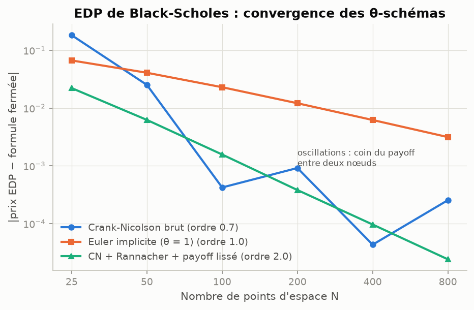
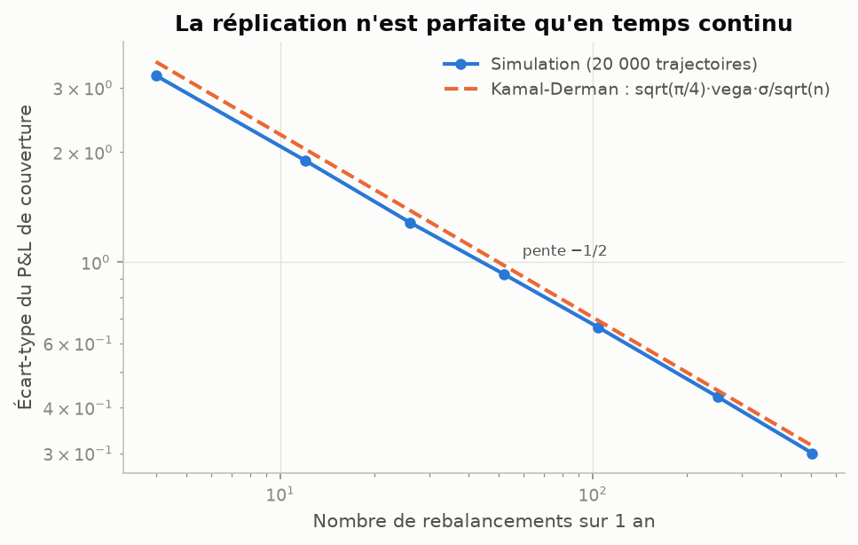
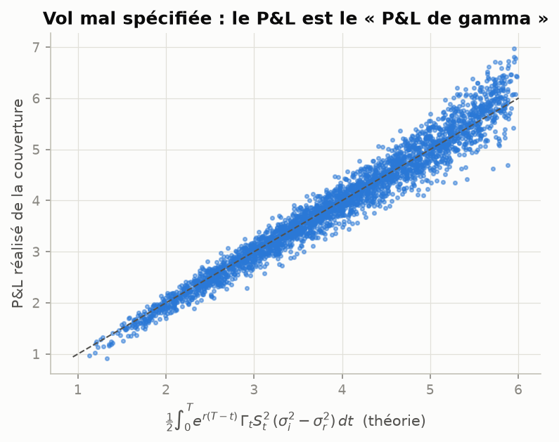
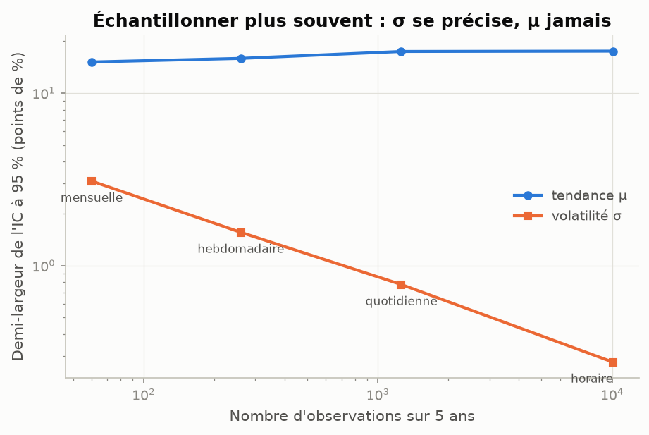
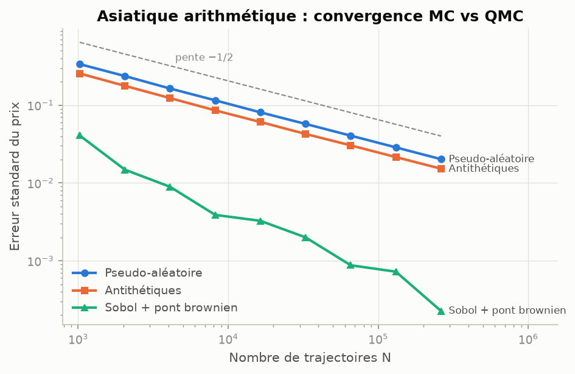
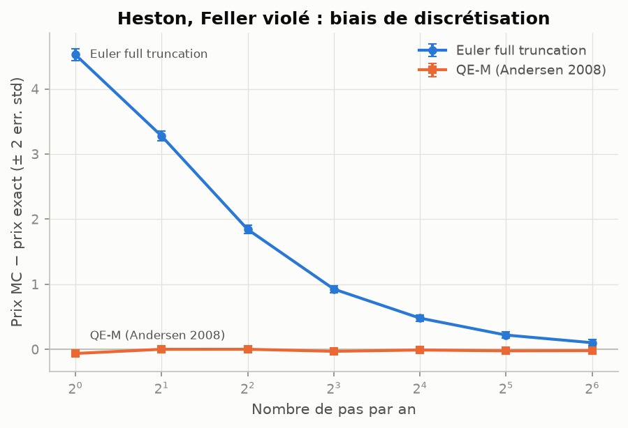
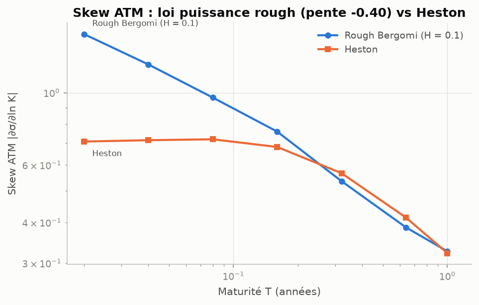
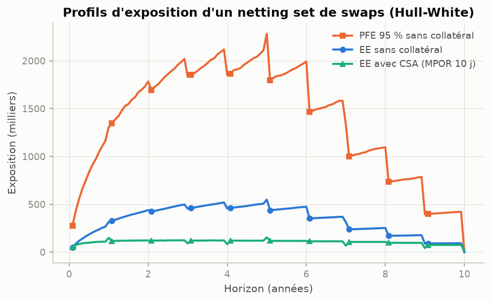

# Monte Carlo pour la salle des marchés — `mcfin`

[](https://github.com/nicolleremanto/Monte-carlo-for-finance-/actions/workflows/tests.yml)


Librairie Python de **pricing et de gestion des risques par simulation**, couvrant les
méthodes Monte Carlo utilisées sur les desks de dérivés actions, de taux et XVA.
Chaque méthode est **validée contre une formule fermée ou un résultat publié** (suite de
tests `pytest`), et la théorie est détaillée dans [`docs/THEORIE.md`](docs/THEORIE.md)
et [`docs/BLACK_SCHOLES.md`](docs/BLACK_SCHOLES.md).

## Contenu

| Domaine | Implémentation |
|---|---|
| **Aléas** | PCG64, **Sobol brouillé** (Owen, Joe-Kuo) avec QMC randomisé, **pont brownien**, ACP, antithétiques, moment matching, stratification |
| **Modèles actions** | Black-Scholes multi-actifs corrélés, Merton, **Heston (QE-M d'Andersen)** et Euler full truncation, Bates, SABR, **volatilité locale de Dupire** sur nappe **SSVI** sans arbitrage, **LSV calibré par méthode particulaire** (Guyon & Henry-Labordère), **rough Bergomi** (schéma hybride + FFT) |
| **Produits** | Européennes, digitales, paniers, worst-of/best-of, asiatiques, **barrières avec correction de pont brownien**, lookbacks, cliquets, swaps de variance, **autocall Phoenix worst-of**, bermudéennes |
| **Américaines** | **Longstaff-Schwartz** (borne inférieure hors échantillon) + **borne duale d'Andersen-Broadie** par simulations imbriquées |
| **Greeks** | Bump & revalue avec nombres aléatoires communs, **pathwise**, **ratio de vraisemblance**, **AAD** (ruban adjoint vectorisé, écrit de zéro) |
| **Réduction de variance** | Variables de contrôle (β par MCO), **échantillonnage préférentiel** (dérive GHS), **Multilevel Monte Carlo** (Giles) |
| **Taux** | **Hull-White** simulé exactement, Jamshidian ; **LIBOR Market Model** (mesure spot, prédicteur-correcteur, vol abcd, ACP) ; **swaptions bermudéennes** |
| **Risques** | **XVA** : profils EE/PFE, CVA/DVA/FVA, netting, **collatéral avec MPOR** ; **VaR/ES** (FRTB) en revalorisation complète vs delta-gamma, Student-t, bootstrap, contributions d'Euler |
| **Black-Scholes de A à Z** | Façade `BlackScholesPricer` (formule fermée, MC, QMC, **EDP Crank-Nicolson**, arbre), 15 Greeks jusqu'à l'ordre 3, gaussiennes **from scratch** (inversion, Box-Muller, polaire, rejet), **américaines par Brennan-Schwartz** avec frontière d'exercice, **couverture delta discrète** (Kamal-Derman, P&L de gamma, Leland), **EMV** et estimateurs de range, **études de couverture des IC** |
| **Formules fermées** | BS/Black/Bachelier + vol implicite robuste, Heston/Bates (Lewis) + calibration, barrières (Reiner-Rubinstein), BGK, asiatique géométrique, lookback, Merton, Hagan, arbre de Leisen-Reimer |

## Installation

```bash
git clone https://github.com/nicolleremanto/Monte-carlo-for-finance-.git
cd Monte-carlo-for-finance-
pip install -e ".[dev]"      # numpy, scipy (+ outils de développement)
make check                   # lint + typage + tests + couverture (~2 min)
```

## Exemple rapide

```python
import numpy as np
import mcfin as mc
from mcfin.analytics import heston_price

# Heston, schéma QE d'Andersen, QMC Sobol + pont brownien
model = mc.Heston(spot=100, v0=0.04, kappa=1.5, theta=0.04, xi=0.8, rho=-0.7,
                  rate=0.03, div=0.01, scheme="qe", dt=1/8)
engine = mc.MonteCarloEngine(n_paths=2**16, method="sobol", construction="bridge")
res = engine.price(model, mc.EuropeanOption(strike=100, maturity=2.0))
print(res)                                             # prix, erreur standard, IC 95 %
print(heston_price(100, 100, 2.0, 0.03, 0.01, model.params))  # référence semi-analytique

# Autocall Phoenix worst-of sur 3 indices
corr = np.array([[1, .75, .6], [.75, 1, .65], [.6, .65, 1]])
bs3 = mc.BlackScholes(spot=np.full(3, 100.), vol=np.array([.18, .22, .25]), rate=.03,
                      div=np.array([.03, .025, .02]), corr=corr)
ac = mc.PhoenixAutocall(np.arange(1, 21) / 4, coupon=0.02, coupon_barrier=0.7,
                        protection_barrier=0.6, initial_levels=np.full(3, 100.))
print(mc.MonteCarloEngine(200_000).price(bs3, ac))
print(mc.MonteCarloEngine(100_000).greeks(bs3, ac, {"vol": 0.01}))   # delta, gamma, vega (CRN)
```

## Black-Scholes : une option, quatre méthodes

```python
from mcfin.blackscholes import BlackScholesPricer, coverage_study, simulate_delta_hedge

opt = BlackScholesPricer(S0=100, K=105, T=1, r=0.03, sigma=0.25, q=0.01)
opt.compare()        # formule fermée / MC / MC antithétique + contrôle / QMC / EDP / arbre
opt.greeks()         # 15 sensibilités (delta ... ultima, dual gamma)
opt.pde(american=True).exercise_boundary          # frontière d'exercice S*(τ)
coverage_study(lambda s: opt.monte_carlo(4000, seed=s), opt.price(), 300)
# -> couverture IC95 = 0.930 [0.895, 0.954], KS p = 0.94, biais p = 0.97 : OK

simulate_delta_hedge(100, 100, 1, 0.03, sigma_real=0.15, sigma_implied=0.25).mean   # ≈ 3.96
```

| Méthode | Écart à la formule fermée | Remarque |
|---|---|---|
| Monte Carlo (200 000 trajectoires) | 0,014 (err. std 0,035) | $O(N^{-1/2})$, pente mesurée −0,50 |
| QMC Sobol randomisé | 0,0005 | ≈ $O(N^{-1})$ |
| EDP Crank-Nicolson + Rannacher + payoff lissé | 0,0001 | **ordre 2,01 mesuré** |
| Arbre de Leisen-Reimer | 5·10⁻⁷ | |

<p align="center">
  
  
  
  
</p>

## Exemples (`examples/`)

| Script | Ce qu'il montre |
|---|---|
| `01_convergence_reduction_variance.py` | QMC + pont brownien : variance ÷ 3 000 ; variable de contrôle géométrique : ÷ 900 |
| `02_heston_schemas.py` | Biais Euler vs QE-M quand la condition de Feller est violée |
| `03_rough_skew.py` | Skew ATM en loi puissance $T^{H-1/2}$ (rough Bergomi) vs Heston |
| `04_lv_vs_lsv_cliquet.py` | LV et LSV repricent les mêmes vanilles mais pas le même cliquet (smile forward) |
| `05_autocall.py` | Prix, profil de rappel, delta/gamma/vega/corrélation d'un autocall |
| `06_american_bounds.py` | Encadrement LSM / dual Andersen-Broadie |
| `07_greeks.py` | Bump vs LRM vs AAD ; échec pathwise sur digitale ; 7 Greeks Heston en une passe adjointe |
| `08_xva.py` | Profils EE/PFE, CVA/DVA/FVA, effet du netting et du collatéral |
| `09_var_es.py` | VaR 99 % / ES 97,5 % : revalorisation complète vs delta-gamma, Student-t |
| `10_mlmc.py` | MLMC : β ≈ 1 (Euler) vs 2 (Milstein), gain ×164 |
| `11_rates.py` | Hull-White, LMM, swaptions bermudéennes |
| `12_black_scholes_lab.py` | Quatre méthodes, générateurs gaussiens, couverture des IC, ordre de l'EDP |
| `13_couverture_delta.py` | Erreur de couverture en $n^{-1/2}$, P&L de gamma, coûts de Leland |
| `14_inference_statistique.py` | EMV : σ se précise, μ jamais ; efficacité des estimateurs de range |

```bash
cd examples && python 01_convergence_reduction_variance.py
```

## Quelques résultats

<p align="center">
  
  
  
  
</p>

| Validation | Monte Carlo | Référence |
|---|---|---|
| Put américain (L-S 2001) | 4,468 ± 0,009 (LSM, 50 dates) | 4,472 |
| Max-call bermudéen (A-B 2004) | [13,90 ; 13,94] (LSM + dual) | [13,892 ; 13,934] |
| Barrières continues (5 types) | pont brownien, 25 dates | Reiner-Rubinstein, < 1 err. std |
| Heston, Feller violé | QE-M, **pas de 1/8 an** | CF de Lewis, < 0,4 err. std |
| Rough Bergomi | pente log-log du skew −0,401 | $H - 1/2 = -0{,}4$ |
| Cliquet ±2 % local | LV 4,39 % / LSV 5,61 % | mêmes vanilles (SSVI) |
| EE d'un swap à une date de reset | XVA Hull-White | swaption de Jamshidian ±0,3 % |
| 7 Greeks Heston | 1 passe AAD (0,25 s) | 14 revalorisations (2,2 s), mêmes valeurs |

## Qualité logicielle

* **108 tests** (`pytest`) dont des **tests de propriétés** (*hypothesis*, 1 500 cas générés) : parité call-put,
  bornes d'arbitrage, convexité en strike, équation de Black-Scholes sur les Greeks, sur des
  centaines de jeux de paramètres tirés au hasard ;
* tests **statistiques** : tolérances exprimées en erreurs standard, couverture des IC testée
  par IC de Wilson, normalité par Kolmogorov-Smirnov ;
* **couverture de code 94 %** (branches incluses), seuil à 90 % imposé en CI ;
* **ruff** (lint + format) et **mypy** sans aucune alerte ; package typé (`py.typed`) ;
* CI GitHub Actions : lint, typage, tests sur Python 3.10 / 3.11 / 3.12 ;
* **revue de code adversariale indépendante** : 6 défauts trouvés (dont une borne duale
  fausse avec une courbe de dividende non plate et une erreur standard surestimée en moment
  matching), tous corrigés et verrouillés par `tests/test_regressions.py` (cf. `CHANGELOG.md`) ;
* `make check` reproduit la CI en local.

## Architecture

```
mcfin/
├── blackscholes/    pricer, sampling, pde, hedging, estimation, diagnostics
├── core/            rng.py (PRNG, Sobol, pont brownien, ACP), timegrid.py, results.py
├── market/          curves.py (plate, interpolée, Nelson-Siegel-Svensson), volsurface.py (SSVI, Dupire)
├── analytics/       formules fermées : black_scholes, heston (+calibration), exotics, sabr, lattice
├── models/          equity.py (BS, Merton, Heston/Bates, SABR), local_vol.py (LV, LSV), rough.py
├── products/        vanilla, path_dependent, autocall, american (LSM + Andersen-Broadie)
├── greeks/          aad.py (ruban adjoint), estimators.py (LRM, pricers différentiables)
├── variance_reduction/  importance_sampling.py, mlmc.py
├── rates/           hull_white.py, lmm.py, bermudan.py
├── risk/            xva.py, var.py
└── engine.py        moteur : lots, RQMC, antithétiques, variables de contrôle, IS, Greeks CRN
```

Principes de conception :
* **modèle / produit / moteur découplés** : tout produit se valorise sous tout modèle
  compatible ; le produit déclare ses dates d'observation, le modèle choisit sa grille ;
* modèles en **dataclasses** : un choc de paramètre (`bump_model`) garde la graine, donc des
  **nombres aléatoires communs** pour les Greeks ;
* **erreur standard correcte** pour chaque technique (paires antithétiques, strates,
  répétitions RQMC) ;
* mémoire bornée : simulation par lots, seules les dates d'observation sont stockées.

## Références principales

Glasserman (2003) · Andersen (2008) · Gatheral (2006) · Guyon & Henry-Labordère (2012) ·
Bayer, Friz & Gatheral (2016) · Bennedsen, Lunde & Pakkanen (2017) · Longstaff & Schwartz
(2001) · Andersen & Broadie (2004) · Giles (2008) · Giles & Glasserman (2006) · Brigo &
Mercurio (2006) · Gregory (2020). Liste complète dans [`docs/THEORIE.md`](docs/THEORIE.md).
